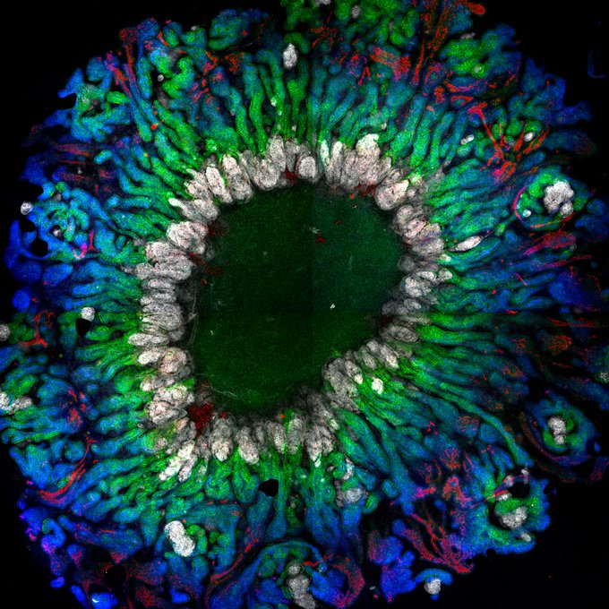

# **[Enhanced metanephric specification to functional proximal tubule enables toxicity screening and infectious disease modelling in kidney organoids](https://www.nature.com/articles/s41467-022-33623-z)** 
<br>

### **[Vanslambrouck et al., 2022](https://www.nature.com/articles/s41467-022-33623-z)**; *Nature Communications*  

<br>

## To further interact with the work in this paper, check out our [Website](https://kidneyregeneration.github.io/Vanslambrouck2022/index.html) showing the analysis and output 

<br>

{width=50px} [Check out the tweetorial from first author Jess describing the study](https://twitter.com/JMVanslambrouck/status/1579397772645912578) <br>

<br>

The altmetric score of this publication is:

```{=html}
<script type="text/javascript" src="https://d1bxh8uas1mnw7.cloudfront.net/assets/embed.js"></script>
```
::: {.altmetric-embed data-badge-type="medium-donut" data-badge-details="right" data-doi="10.1038/s41467-022-33623-z"}
:::

<br>



## Abstract

While pluripotent stem cell-derived kidney organoids are now being used to model renal disease, the proximal nephron remains immature with limited evidence for key functional solute channels. This may reflect early mispatterning of the nephrogenic mesenchyme and/or insufficient maturation. Here we show that enhanced specification to metanephric nephron progenitors results in elongated and radially aligned proximalised nephrons with distinct S1 - S3 proximal tubule cell types. Such PT-enhanced organoids possess improved albumin and organic cation uptake, appropriate KIM-1 upregulation in response to cisplatin, and improved expression of SARS-CoV-2 entry factors resulting in increased viral replication. The striking proximo-distal orientation of nephrons resulted from localized WNT antagonism originating from the organoid stromal core. PT-enhanced organoids represent an improved model to study inherited and acquired proximal tubular disease as well as drug and viral responses.

### Data availability
The transcriptional profiling datasets generated in this study have been deposited in GEO under accession code [GSE184928](https://www.ncbi.nlm.nih.gov/geo/query/acc.cgi?acc=GSE184928). The raw data from scRNAseq and immunofluorescence image analyses have been deposited in the Github repository [https://github.com/KidneyRegeneration/Vanslambrouck2022]. Raw and processed data from qRT-PCR, TCID50 assays, and image analyses are provided in the [Source data](https://www.nature.com/articles/s41467-022-33623-z#Sec31) file

